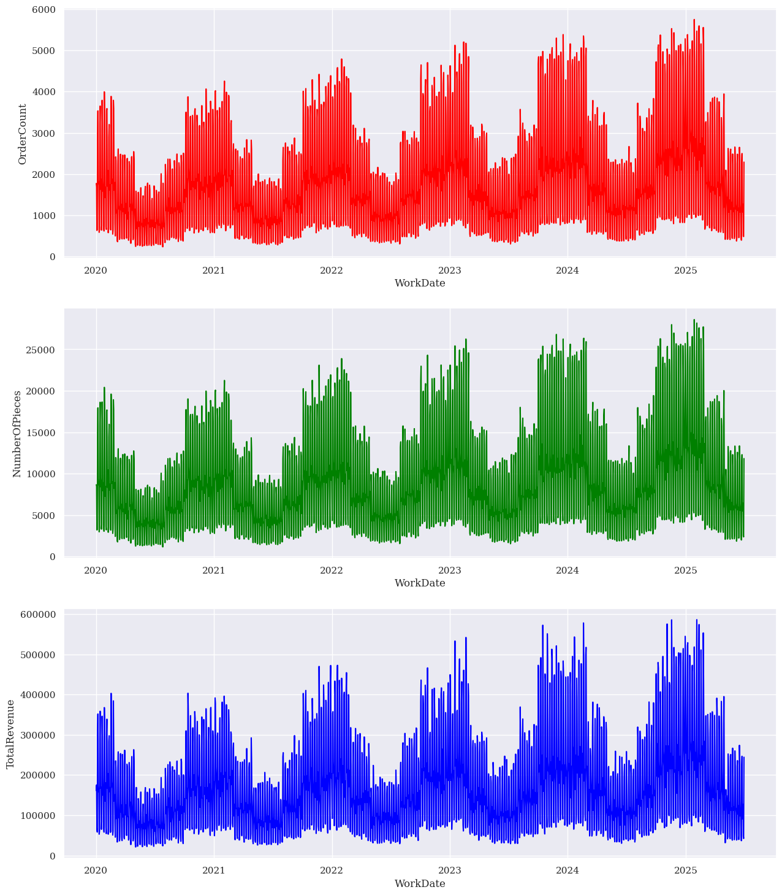
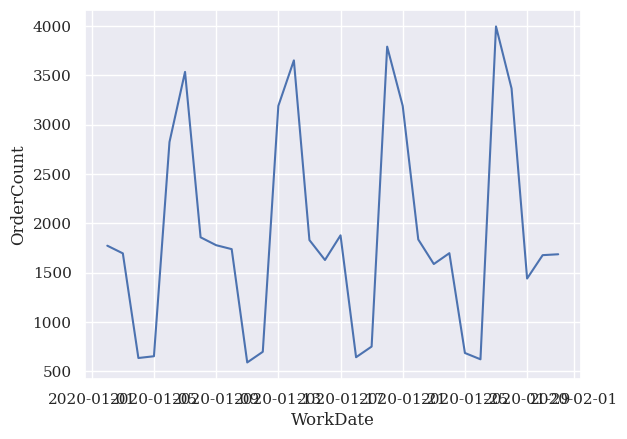
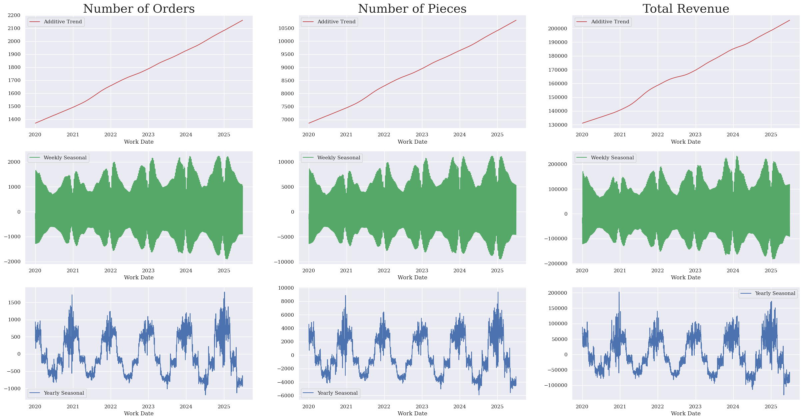
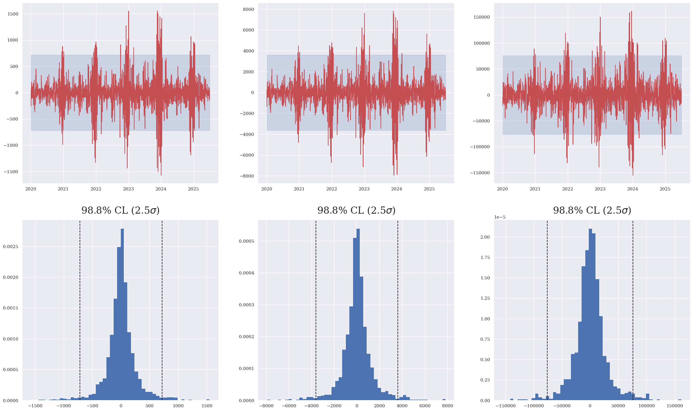
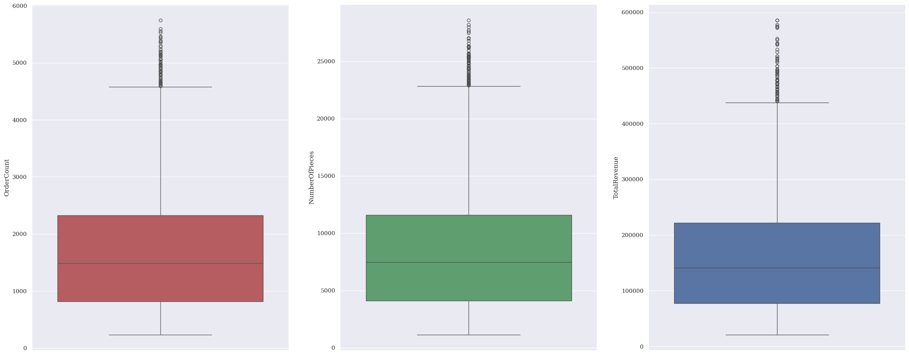
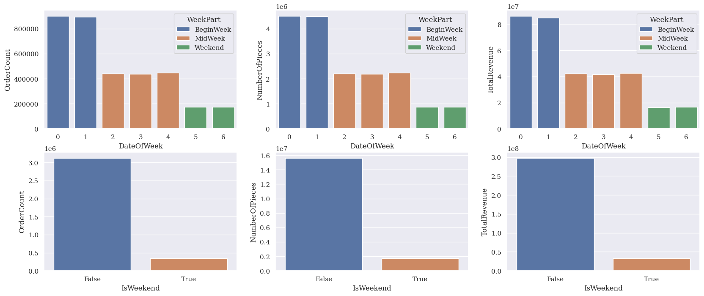
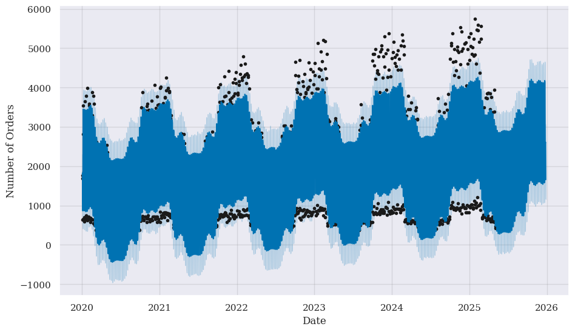
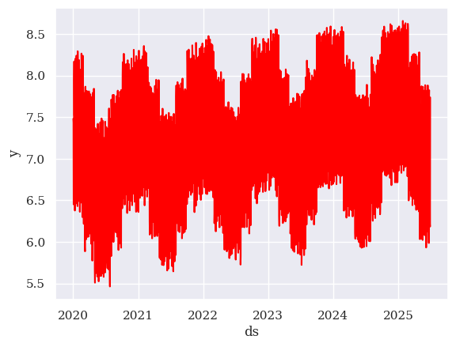
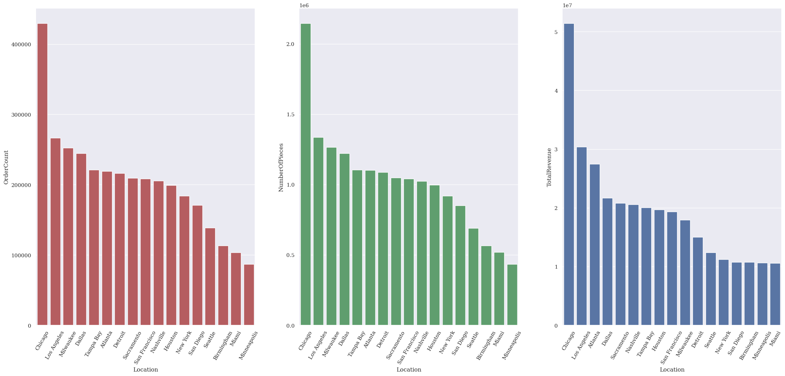
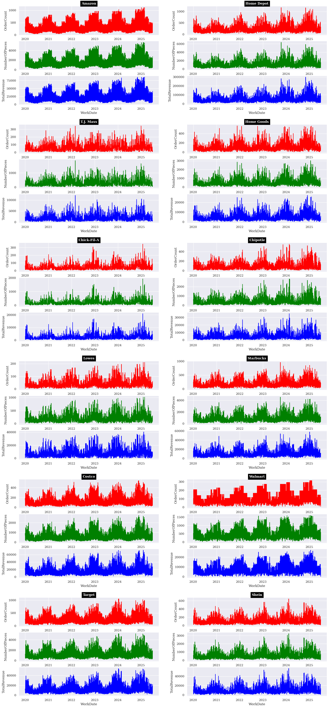

# **Analytics of the delivery time series**

1. *Dataset*: The dataset "supply_chain_deliveries.cvs" is taken from _[Kaggle](https://www.kaggle.com/datasets/philiphyde1/time-series-supply-chain-dataset)_. This dataset contains 5 years of simulated delivery data for several customers in several different locations
2. *Objectives*:
> - Analysis of time series (visualization, seasonal decomposition, and outliers).
> - Analysis of the dependence on locations, customers and business types (or delivery stages) of delivery
> - Time series prediction

3. *Tools for time-series analytics*:
> - Multiple Seasonal-Trend decomposition using Loess (MSTL): multi-seasonal decomposition and outlier detections
> - Facebook's Prophet: forecasting
> - Matplotlib and Seaborn: visualization


```python
import pandas as pd
import numpy as np
import matplotlib.pyplot as plt
import seaborn as sns

from statsmodels.tsa.seasonal import STL, MSTL
from prophet import Prophet
import warnings
import logging

logging.getLogger("prophet").setLevel(logging.WARNING)
logging.getLogger("cmdstanpy").disabled=True

warnings.filterwarnings('ignore')

sns.set_theme()
plt.rcParams['font.size'] = 24
plt.rcParams["font.family"] = 'serif'

pd.set_option('expand_frame_repr', False)
%matplotlib inline
```


```python
# import the data and check the general info
df = pd.read_csv("supply_chain_deliveries.csv")
print("Number of duplicated items:", df.duplicated().sum())
print(df.info())
print()
print("The first three values:")
print()
print(df.head(3))
print()
print("The last three values:")
print()
print(df.tail(3))
```

    Number of duplicated items: 0
    <class 'pandas.core.frame.DataFrame'>
    RangeIndex: 126255 entries, 0 to 126254
    Data columns (total 7 columns):
     #   Column          Non-Null Count   Dtype  
    ---  ------          --------------   -----  
     0   WorkDate        126255 non-null  object 
     1   Customer        126255 non-null  object 
     2   Location        126255 non-null  object 
     3   BusinessType    126255 non-null  object 
     4   OrderCount      126255 non-null  int64  
     5   NumberOfPieces  126255 non-null  int64  
     6   TotalRevenue    126255 non-null  float64
    dtypes: float64(1), int64(2), object(4)
    memory usage: 6.7+ MB
    None
    
    The first three values:
    
         WorkDate    Customer    Location BusinessType  OrderCount  NumberOfPieces  TotalRevenue
    0  2020-01-02      Amazon     Chicago   Final Mile          38             190       2084.09
    1  2020-01-02  Home Depot  Sacramento   Final Mile          34             136       6153.01
    2  2020-01-02  Home Depot     Chicago   Final Mile          43             215      15691.72
    
    The last three values:
    
              WorkDate   Customer    Location BusinessType  OrderCount  NumberOfPieces  TotalRevenue
    126252  2025-06-30     Costco  Birmingham   First Mile          10              50        780.81
    126253  2025-06-30    Walmart     Chicago  Middle Mile          67             335       7892.75
    126254  2025-06-30  Starbucks  Sacramento  Middle Mile          22             132       1134.63


```python
# print the unique value of categorical attributes
customers = df['Customer'].unique()
print(len(customers), customers)
locations = df['Location'].unique()
print(len(locations), locations)
business_types = df['BusinessType'].unique()
print(len(business_types), business_types)
```

    12 ['Amazon' 'Home Depot' 'T.J. Maxx' 'Home Goods' 'Chick-Fil-A' 'Chipotle'
     'Lowes' 'Starbucks' 'Costco' 'Walmart' 'Target' 'Shein']
    17 ['Chicago' 'Sacramento' 'Detroit' 'Atlanta' 'Houston' 'Seattle'
     'San Francisco' 'Los Angeles' 'Birmingham' 'Tampa Bay' 'Dallas' 'Miami'
     'Milwaukee' 'Nashville' 'San Diego' 'Minneapolis' 'New York']
    3 ['Final Mile' 'Middle Mile' 'First Mile']


The dataset has 126255 items on deliveries in 5 years (2020-2025), of the following 7 attributes:
- WorkDate: from 2020-01-02 to 2025-06-30
- Customer: there are 12 different customers in the list ('Amazon', 'Home Depot', 'T.J. Maxx', 'Home Goods', 'Chick-Fil-A', 'Chipotle', 'Lowes', 'Starbucks', 'Costco', 'Walmart', 'Target', 'Shein')
- Location: there are 17 different hub locations where orders originated from in the dataset.
- BusinessType: there are three types of delivery done, corresponding to three stages of delivery 'Final Mile', 'Middle Mile', and 'First Mile'.
- OrderCount: number of orders
- NumberOfPieces: number of deliveried pieces
- TotalRevenue: total revenue collected from deliveries (in US dollar)
  
There are no missing values and no duplicated values. Except for the WorkDate column, which should be of the datetime type, all other columns are in the correct datatypes. In addition, there is no formatting needed to be performed. 


```python
# change the Workdate to datetime datatype
df["WorkDate"] = pd.to_datetime(df["WorkDate"])
df.info()
```

    <class 'pandas.core.frame.DataFrame'>
    RangeIndex: 126255 entries, 0 to 126254
    Data columns (total 7 columns):
     #   Column          Non-Null Count   Dtype         
    ---  ------          --------------   -----         
     0   WorkDate        126255 non-null  datetime64[ns]
     1   Customer        126255 non-null  object        
     2   Location        126255 non-null  object        
     3   BusinessType    126255 non-null  object        
     4   OrderCount      126255 non-null  int64         
     5   NumberOfPieces  126255 non-null  int64         
     6   TotalRevenue    126255 non-null  float64       
    dtypes: datetime64[ns](1), float64(1), int64(2), object(3)
    memory usage: 6.7+ MB


## 1. Time-series data summing all consumers, locations and business types.
### 1a. Data grouping and holiday-closures identification


```python
import holidays
# Group data by date only to calculate the sums of numeric values
df_bydate = df.groupby(by=["WorkDate"],as_index=True)[['OrderCount','NumberOfPieces','TotalRevenue']].sum()

# Finding out the closures
date_range = pd.date_range(start = min(df_bydate.index), end = max(df_bydate.index))
holiday_closures = [d for d in date_range if d not in df_bydate.index]
holiday_closures = pd.DataFrame(holiday_closures)
holiday_closures.columns = ['ClosureDate']
us_holidays = holidays.US()
holiday_closures['Holiday'] = holiday_closures['ClosureDate'].map(us_holidays.get)
print(holiday_closures)
```

       ClosureDate           Holiday
    0   2020-07-04  Independence Day
    1   2020-11-26  Thanksgiving Day
    2   2020-12-25     Christmas Day
    3   2021-01-01    New Year's Day
    4   2021-07-04  Independence Day
    5   2021-11-25  Thanksgiving Day
    6   2021-12-25     Christmas Day
    7   2022-01-01    New Year's Day
    8   2022-07-04  Independence Day
    9   2022-11-24  Thanksgiving Day
    10  2022-12-25     Christmas Day
    11  2023-01-01    New Year's Day
    12  2023-07-04  Independence Day
    13  2023-11-23  Thanksgiving Day
    14  2023-12-25     Christmas Day
    15  2024-01-01    New Year's Day
    16  2024-07-04  Independence Day
    17  2024-11-28  Thanksgiving Day
    18  2024-12-25     Christmas Day
    19  2025-01-01    New Year's Day


There are the holidays closures (without any demand) on the New Year (01 Jan), US's Independent Day (04 July), Thanksgiving day, and Chrismast (25 Dec). Since the model used later for prediction (Prophet) does not require the regular timestamp, we do not need to imputing these gap.

### 1b. Plot the time series evolution and the underlying components
Now the missing values are already imputed. Let's plot the time series.


```python
# plot the time evolution graphs
#df_bydate.set_index('WorkDate',inplace=True)
fig_ts, ax_ts = plt.subplots(3,1,figsize=(15,18))
sns.lineplot(data=df_bydate, x=df_bydate.index, y='OrderCount',ax=ax_ts[0],color='red')
sns.lineplot(data=df_bydate, x=df_bydate.index, y='NumberOfPieces',ax=ax_ts[1],color='green')
sns.lineplot(data=df_bydate, x=df_bydate.index, y='TotalRevenue',ax=ax_ts[2],color='blue')
```


    <Axes: xlabel='WorkDate', ylabel='TotalRevenue'>


    

    


```python
df_bydate_short = df_bydate.head(30)
sns.lineplot(data=df_bydate_short, x=df_bydate_short.index, y='OrderCount')
```


    <Axes: xlabel='WorkDate', ylabel='OrderCount'>


    

    


There are multi-seasonal effects in the time series for all three targets with 1-year and 1-week periods. In particular, the delivery gets peaked at the beginning and the end of years (typically from Oct-Feb) and on Monday-Tuesday, and becomes less vibrant in the middle of the year and in the weekend. Let's now remove (decompose) these seasonal effects to see the trend. We use the **Multiple Seasonal-Trend decomposition using LOESS (MSTL)** for daily data with periods 7 (weekly) and 365 (yearly).


```python
order_decompose = MSTL(df_bydate['OrderCount'], periods = [7,365])
order_decompose_result = order_decompose.fit()
#print(order_decompose_result.trend)

npiece_decompose = MSTL(df_bydate['NumberOfPieces'], periods = [7,365])
npiece_decompose_result = npiece_decompose.fit()
#print(npiece_decompose_result.trend)

revenue_decompose = MSTL(df_bydate['TotalRevenue'], periods = [7,365])
revenue_decompose_result = revenue_decompose.fit()
```


```python
fig_seasonal, ax_seasonal = plt.subplots(3,3,figsize=(30,15))
#
ax_seasonal[0][0].plot(order_decompose_result.trend, color='r', label='Additive Trend')
ax_seasonal[1][0].plot(order_decompose_result.seasonal["seasonal_7"], color='g', label='Weekly Seasonal')
ax_seasonal[2][0].plot(order_decompose_result.seasonal["seasonal_365"], color='b', label='Yearly Seasonal')
ax_seasonal[0][0].legend()
ax_seasonal[1][0].legend()
ax_seasonal[2][0].legend()
ax_seasonal[0][0].set_title("Number of Orders",fontsize=26)
#
ax_seasonal[0][1].plot(npiece_decompose_result.trend, color='r', label='Additive Trend')
ax_seasonal[1][1].plot(npiece_decompose_result.seasonal["seasonal_7"], color='g', label='Weekly Seasonal')
ax_seasonal[2][1].plot(npiece_decompose_result.seasonal["seasonal_365"], color='b', label='Yearly Seasonal')
ax_seasonal[0][1].legend()
ax_seasonal[1][1].legend()
ax_seasonal[2][1].legend()
ax_seasonal[0][1].set_title("Number of Pieces",fontsize=26)
#
ax_seasonal[0][2].plot(revenue_decompose_result.trend, color='r', label='Additive Trend')
ax_seasonal[1][2].plot(revenue_decompose_result.seasonal["seasonal_7"], color='g', label='Weekly Seasonal')
ax_seasonal[2][2].plot(revenue_decompose_result.seasonal["seasonal_365"], color='b', label='Yearly Seasonal')
ax_seasonal[0][2].legend()
ax_seasonal[1][2].legend()
ax_seasonal[2][2].legend()
ax_seasonal[0][2].set_title("Total Revenue",fontsize=26)
for i in range(3):
    for j in range(3):
        ax_seasonal[i][j].set_xlabel('Work Date')

```


    

    


We see that all three properties exhibit approximately linear increasing trend, which is augumented by seasonal effects. 

### 1c. Anomaly detection using MSTL results: 
We set the threshold to 2.5 sigmas to identify the ouliers


```python
import math
# Set threshold (the number of sigmas) and calculate the confidence level
threshold = 2.5
cl = round(100*math.erf(threshold/np.sqrt(2)),1)     
print(f"Threshold: {threshold} sigmas, corresponding to {cl}% CL")

# order
order_resid_mean = order_decompose_result.resid.mean()
order_resid_std = order_decompose_result.resid.std()
order_lower_bound = order_resid_mean - threshold*order_resid_std
order_upper_bound = order_resid_mean + threshold*order_resid_std

# npiece
npiece_resid_mean = npiece_decompose_result.resid.mean()
npiece_resid_std = npiece_decompose_result.resid.std()
npiece_lower_bound = npiece_resid_mean - threshold*npiece_resid_std
npiece_upper_bound = npiece_resid_mean + threshold*npiece_resid_std

# revenue
revenue_resid_mean = revenue_decompose_result.resid.mean()
revenue_resid_std = revenue_decompose_result.resid.std()
revenue_lower_bound = revenue_resid_mean - threshold*revenue_resid_std
revenue_upper_bound = revenue_resid_mean + threshold*revenue_resid_std

```

    Threshold: 2.5 sigmas, corresponding to 98.8% CL


```python
# Looking at the residual distributions
fig_residual, ax_residual = plt.subplots(2,3,figsize=(30,18))
ax_residual[0][0].plot(order_decompose_result.resid, color='r', label='Residual')
ax_residual[0][1].plot(npiece_decompose_result.resid, color='r', label='Residual')
ax_residual[0][2].plot(revenue_decompose_result.resid, color='r', label='Residual')
ax_residual[0][0].fill_between(order_decompose_result.resid.index,order_lower_bound, order_upper_bound, color='b',alpha=0.2)
ax_residual[0][1].fill_between(npiece_decompose_result.resid.index,npiece_lower_bound, npiece_upper_bound, color='b',alpha=0.2)
ax_residual[0][2].fill_between(revenue_decompose_result.resid.index,revenue_lower_bound, revenue_upper_bound, color='b',alpha=0.2)

ax_residual[1][0].hist(order_decompose_result.resid, bins=50, density=True, histtype='stepfilled')
ax_residual[1][1].hist(npiece_decompose_result.resid, bins=50, density=True, histtype='stepfilled')
ax_residual[1][2].hist(revenue_decompose_result.resid, bins=50, density=True, histtype='stepfilled')
ax_residual[1][0].axvline(order_lower_bound, ls='--', color='k')
ax_residual[1][0].axvline(order_upper_bound, ls='--', color='k')
ax_residual[1][1].axvline(npiece_lower_bound, ls='--', color='k')
ax_residual[1][1].axvline(npiece_upper_bound, ls='--', color='k')
ax_residual[1][2].axvline(revenue_lower_bound, ls='--', color='k')
ax_residual[1][2].axvline(revenue_upper_bound, ls='--', color='k')

ax_residual[1][0].text(0.5, 1.05, f'{cl}% CL ({threshold}$\sigma$)', horizontalalignment='center',
     verticalalignment='center', transform=ax_residual[1][0].transAxes)
ax_residual[1][1].text(0.5, 1.05, f'{cl}% CL ({threshold}$\sigma$)', horizontalalignment='center',
     verticalalignment='center', transform=ax_residual[1][1].transAxes)
ax_residual[1][2].text(0.5, 1.05, f'{cl}% CL ({threshold}$\sigma$)', horizontalalignment='center',
     verticalalignment='center', transform=ax_residual[1][2].transAxes)
```


    Text(0.5, 1.05, '98.8% CL (2.5$\\sigma$)')


    

    


```python
# Find out the outliers with 2.5 sigmas threshold
order_anomalies = df_bydate['OrderCount'][
    (order_decompose_result.resid < order_lower_bound) | (order_decompose_result.resid > order_upper_bound)]
npiece_anomalies = df_bydate['NumberOfPieces'][
    (npiece_decompose_result.resid < npiece_lower_bound) | (npiece_decompose_result.resid > npiece_upper_bound)]
revenue_anomalies = df_bydate['TotalRevenue'][
    (revenue_decompose_result.resid < revenue_lower_bound) | (revenue_decompose_result.resid > revenue_upper_bound)]

# Find out the demand spikes with 2.5 sigmas threshold
order_spikes = df_bydate['OrderCount'][(order_decompose_result.resid > order_upper_bound)]
npiece_spikes = df_bydate['NumberOfPieces'][(npiece_decompose_result.resid > npiece_upper_bound)]
revenue_spikes = df_bydate['TotalRevenue'][(revenue_decompose_result.resid > revenue_upper_bound)]

# Considering the spikes in number of orders
order_spikes = pd.DataFrame(order_spikes)
print(order_spikes)

```

                OrderCount
    WorkDate              
    2020-12-15        3481
    2020-12-21        3767
    2021-01-04        3995
    2021-12-06        3571
    2021-12-13        4125
    2021-12-23        2210
    2021-12-24        1729
    2021-12-27        4113
    2021-12-31        2066
    2022-01-03        3873
    2022-01-04        3819
    2022-01-10        4159
    2022-10-04        4647
    2022-11-28        3965
    2022-12-05        4640
    2022-12-13        4464
    2022-12-20        3410
    2022-12-26        4400
    2022-12-27        4075
    2023-01-02        4628
    2023-01-03        4320
    2023-02-28        4848
    2023-11-14        5066
    2023-11-21        4794
    2023-11-27        5299
    2023-12-04        4873
    2023-12-11        4960
    2023-12-18        5384
    2023-12-19        4456
    2023-12-26        4286
    2023-12-29        2534
    2024-01-02        4751
    2024-01-08        4900
    2024-01-09        5159
    2024-11-22        2208
    2024-12-02        4995
    2024-12-30        5281
    2025-01-06        5382
    2025-01-13        4851


Looking at these outliers, one can see that there were usually demand spikes around the Thanksgiving, between Christmas and New Year Eve, and in few days after the New Year. 


```python
# Plot the outliers on the time series
fig_ts_outliers, ax_ts_outliers = plt.subplots(1,3,figsize=(30,10))
sns.lineplot(data=df_bydate, x=df_bydate.index, y='OrderCount',ax=ax_ts_outliers[0],color='red',alpha=0.4)
sns.lineplot(data=df_bydate, x=df_bydate.index, y='NumberOfPieces',ax=ax_ts_outliers[1],color='green',alpha=0.4)
sns.lineplot(data=df_bydate, x=df_bydate.index, y='TotalRevenue',ax=ax_ts_outliers[2],color='blue',alpha=0.4)

ax_ts_outliers[0].scatter(y=order_anomalies, x=order_anomalies.index, c='k')
ax_ts_outliers[1].scatter(y=npiece_anomalies, x=npiece_anomalies.index, c='k')
ax_ts_outliers[2].scatter(y=revenue_anomalies, x=revenue_anomalies.index, c='k')

ax_ts_outliers[0].scatter(y=order_spikes, x=order_spikes.index, c='y')
ax_ts_outliers[1].scatter(y=npiece_spikes, x=npiece_spikes.index, c='y')
ax_ts_outliers[2].scatter(y=revenue_spikes, x=revenue_spikes.index, c='y')
```


    <matplotlib.collections.PathCollection at 0x7c52144f6930>


    

    


### 1d. Overall distributions 
Let us know plot the distributions of three indicators.


```python
# Histogram
fig_bydate_hist, ax_bydate_hist = plt.subplots(1,3,figsize=(30,12))
sns.histplot(data=df_bydate, x="OrderCount", stat = 'density', bins=30, kde=False, ax = ax_bydate_hist[0],color='r')
sns.kdeplot(data=df_bydate, x="OrderCount",ax = ax_bydate_hist[0],color='k')
sns.histplot(data=df_bydate, x="NumberOfPieces", stat = 'density', bins=30, kde=False, ax = ax_bydate_hist[1],color='g')
sns.kdeplot(data=df_bydate, x="NumberOfPieces",ax = ax_bydate_hist[1],color='k')
sns.histplot(data=df_bydate, x="TotalRevenue", stat = 'density', bins=30, kde=False, ax = ax_bydate_hist[2],color='b')
sns.kdeplot(data=df_bydate, x="TotalRevenue",ax = ax_bydate_hist[2],color='k')
ax_bydate_hist[0].set_title("Number of Orders")
ax_bydate_hist[1].set_title("Number of Pieces")
ax_bydate_hist[2].set_title("Total Revenue")

# boxplot
fig_bydate_box, ax_bydate_box = plt.subplots(1,3,figsize=(30,12))
sns.boxplot(data=df_bydate, y="OrderCount", ax = ax_bydate_box[0],color='r')
sns.boxplot(data=df_bydate, y="NumberOfPieces", ax = ax_bydate_box[1],color='g')
sns.boxplot(data=df_bydate, y="TotalRevenue", ax = ax_bydate_box[2],color='b')
```


    <Axes: ylabel='TotalRevenue'>


    

    


    

    


We see that their distributions have a similar shape, which is right skewed. There is a non-negligible number of outliers which are significantly distant from the upper whisker. Some of these indicates demand spikes in the time series. 

### 1e. Analysis the distribution by date of week and by season


```python
# add season, month, and day of week columns to the dataset
seasons_partition = {
    'Winter':[12, 1, 2],
    'Spring':[3, 4, 5],
    'Summer':[6, 7, 8],
    'Autumn':[9, 10, 11]
}
def keyLookup(requiredVal):
    for key, val in seasons_partition.items():
        if requiredVal in val:
            return key
def partLookup(requiredVal):
    if (requiredVal == 0) or (requiredVal == 1):
        return 'BeginWeek'
    elif (requiredVal == 3) or (requiredVal == 2) or (requiredVal == 4):
        return 'MidWeek'
    else:
        return 'Weekend'

df_bydate['DateOfWeek'] = df_bydate.index.dayofweek
df_bydate['IsWeekend'] = (df_bydate['DateOfWeek'] == 5) | (df_bydate['DateOfWeek'] == 6)
df_bydate['Month'] = df_bydate.index.month
df_bydate['Year'] = df_bydate.index.year
df_bydate['Season'] = df_bydate['Month'].map(keyLookup)
df_bydate['WeekPart'] = df_bydate['DateOfWeek'].map(partLookup)
print(df_bydate.head())

days_of_week = df_bydate['DateOfWeek'].unique().tolist()
seasons = df_bydate['Season'].unique().tolist()
```

                OrderCount  NumberOfPieces  TotalRevenue  DateOfWeek  IsWeekend  Month  Year  Season   WeekPart
    WorkDate                                                                                                   
    2020-01-02        1772            8653     161607.16           3      False      1  2020  Winter    MidWeek
    2020-01-03        1694            8483     175312.27           4      False      1  2020  Winter    MidWeek
    2020-01-04         633            3195      68512.12           5       True      1  2020  Winter    Weekend
    2020-01-05         651            3244      58218.17           6       True      1  2020  Winter    Weekend
    2020-01-06        2823           13964     306535.70           0      False      1  2020  Winter  BeginWeek


```python
# Group by date of week and by IsWeekend
df_bydate_dow = df_bydate.groupby(by=['DateOfWeek'],as_index=False)[['OrderCount','NumberOfPieces','TotalRevenue']].sum()
df_bydate_iw = df_bydate.groupby(by=['IsWeekend'],as_index=False)[['OrderCount','NumberOfPieces','TotalRevenue']].sum()
df_bydate_dow['WeekPart'] = df_bydate_dow['DateOfWeek'].map(partLookup)
print(df_bydate_dow.head(10))
print(df_bydate_iw.head())

# Bar Plot
fig_bydate_week_bar, ax_bydate_week_bar = plt.subplots(2,3,figsize=(20,8))
sns.barplot(data = df_bydate_dow, x = 'DateOfWeek' , y = 'OrderCount', ax = ax_bydate_week_bar[0][0], hue = "WeekPart")
sns.barplot(data = df_bydate_dow, x = 'DateOfWeek', y = 'NumberOfPieces', ax = ax_bydate_week_bar[0][1], hue = "WeekPart")
sns.barplot(data = df_bydate_dow, x = 'DateOfWeek', y = 'TotalRevenue', ax = ax_bydate_week_bar[0][2], hue = "WeekPart")

sns.barplot(data = df_bydate_iw, x = 'IsWeekend', y = 'OrderCount', ax = ax_bydate_week_bar[1][0], hue = 'IsWeekend',legend=False)
sns.barplot(data = df_bydate_iw, x = 'IsWeekend', y = 'NumberOfPieces', ax = ax_bydate_week_bar[1][1], hue = 'IsWeekend',legend=False)
sns.barplot(data = df_bydate_iw, x = 'IsWeekend', y = 'TotalRevenue', ax = ax_bydate_week_bar[1][2], hue = 'IsWeekend',legend=False)

# Box plot
fig_bydate_week_box, ax_bydate_week_box = plt.subplots(2,3,figsize=(20,8))
sns.boxplot(data=df_bydate, x='DateOfWeek', y='OrderCount', ax = ax_bydate_week_box[0][0],hue="WeekPart")
sns.boxplot(data=df_bydate, x='DateOfWeek', y='NumberOfPieces', ax = ax_bydate_week_box[0][1],hue="WeekPart")
sns.boxplot(data=df_bydate, x='DateOfWeek', y='TotalRevenue', ax = ax_bydate_week_box[0][2],hue="WeekPart")

sns.boxplot(data=df_bydate, x='IsWeekend', y='OrderCount', ax = ax_bydate_week_box[1][0], hue='IsWeekend',legend=False)
sns.boxplot(data=df_bydate, x='IsWeekend', y='NumberOfPieces', ax = ax_bydate_week_box[1][1], hue='IsWeekend',legend=False)
sns.boxplot(data=df_bydate, x='IsWeekend', y='TotalRevenue', ax = ax_bydate_week_box[1][2], hue='IsWeekend',legend=False)
```

       DateOfWeek  OrderCount  NumberOfPieces  TotalRevenue   WeekPart
    0           0      903064         4513708   86542687.71  BeginWeek
    1           1      895309         4484458   84962400.10  BeginWeek
    2           2      442628         2212198   42224203.84    MidWeek
    3           3      437532         2185540   41566518.29    MidWeek
    4           4      446889         2230787   42519755.41    MidWeek
    5           5      172063          862219   16439742.73    Weekend
    6           6      172982          864571   16480949.01    Weekend
       IsWeekend  OrderCount  NumberOfPieces  TotalRevenue
    0      False     3125422        15626691  2.978156e+08
    1       True      345045         1726790  3.292069e+07


    <Axes: xlabel='IsWeekend', ylabel='TotalRevenue'>


    

    


    

    


The above plots indicate that we can partition the weekly delivery into two or three sectors:
- Firstly, we can partition the weekly delivery into three distinct ranges of the week: BeginWeek (Mon-Tue), MidWeek (Wed-Fri), and Weekend (Sat-Sun). The delivery decreases from BeginWeek to Weekend, and the total delivery value of the BeginWeek is approximately equal to the total value of the other days in total. This indicate that the BeginWeek delivery dominates over the other ranges of delivery in a week. In addition, all days in each range have very similar total delivery values and very similar distributions. 
- One can also divide the weekly delivery into two pools (Weekday and Weekend). From the above discussion, the weekday delivery should dominate over the weekend delivery. This is indeed the case: the delivery in the weekend is about ten times larger than during the weekday.

These properties can be expected from the time series visualization.


```python
# Group by date of Season and by Month
df_bydate_month = df_bydate.groupby(by=['Month'],as_index=False)[['OrderCount','NumberOfPieces','TotalRevenue']].sum()
df_bydate_month['Season'] = df_bydate_month['Month'].map(keyLookup)
df_bydate_season = df_bydate.groupby(by=['Season'],as_index=False)[['OrderCount','NumberOfPieces','TotalRevenue']].sum()

fig_bydate_month, ax_bydate_month = plt.subplots(2,3,figsize=(20,10))
sns.barplot(data = df_bydate_month, x = 'Month', y = 'OrderCount', ax = ax_bydate_month[0][0], hue = "Season")
sns.barplot(data = df_bydate_month, x = 'Month', y = 'NumberOfPieces', ax = ax_bydate_month[0][1], hue = "Season")
sns.barplot(data = df_bydate_month, x = 'Month', y = 'TotalRevenue', ax = ax_bydate_month[0][2], hue = "Season")

sns.boxplot(data=df_bydate, x='Month', y='OrderCount', ax = ax_bydate_month[1][0],hue="Season")
sns.boxplot(data=df_bydate, x='Month', y='NumberOfPieces', ax = ax_bydate_month[1][1],hue="Season")
sns.boxplot(data=df_bydate, x='Month', y='TotalRevenue', ax = ax_bydate_month[1][2],hue="Season")
```


    <Axes: xlabel='Month', ylabel='TotalRevenue'>


    

    


```python
fig_bydate_season, ax_bydate_season = plt.subplots(2,3,figsize=(20,10))
sns.barplot(data = df_bydate_season, x = 'Season', y = 'OrderCount', ax = ax_bydate_season[0][0], hue = "Season")
sns.barplot(data = df_bydate_season, x = 'Season', y = 'NumberOfPieces', ax = ax_bydate_season[0][1], hue = "Season")
sns.barplot(data = df_bydate_season, x = 'Season', y = 'TotalRevenue', ax = ax_bydate_season[0][2], hue = "Season")

sns.boxplot(data=df_bydate, x='Season', y='OrderCount', ax = ax_bydate_season[1][0],hue="Season")
sns.boxplot(data=df_bydate, x='Season', y='NumberOfPieces', ax = ax_bydate_season[1][1],hue="Season")
sns.boxplot(data=df_bydate, x='Season', y='TotalRevenue', ax = ax_bydate_season[1][2],hue="Season")
```


    <Axes: xlabel='Season', ylabel='TotalRevenue'>


    

    


These plots reflect again the yearly seasonal feature observed in the time series: The delivery becomes high during Oct-Feb (or Autumn-Winter), while it is less during the middle of the year (or Spring-Summer).

### 1f. OrderCount prediction with Prophet
First, let's fit the default Prophet model and make prediction


```python
from prophet.diagnostics import cross_validation, performance_metrics
import itertools
# prepare the data 
df_order = pd.DataFrame(df_bydate['OrderCount'])
df_order.reset_index(inplace=True)
df_order.columns = ['ds','y']

# Model fitting
model_raw = Prophet()
result_raw = model_raw.fit(df_order[['ds','y']])

# prediction and plot
future_dates_raw = model_raw.make_future_dataframe(periods=180, freq='D')
forecast_raw = model_raw.predict(future_dates_raw)

# cross validation and calculate two metrics RMSE and MAPE
df_raw_cv = cross_validation(model_raw, initial='730 days', period='90 days', horizon = '120 days', parallel="processes")
df_raw_p = performance_metrics(df_raw_cv, rolling_window=1)
print('RMSE: ',df_raw_p['rmse'].values[0])
print('MAPE: ',df_raw_p['mape'].values[0])

model_raw.plot(forecast_raw, uncertainty=True, xlabel='Date', ylabel='Number of Orders');
```

    RMSE:  430.35031151445367
    MAPE:  0.19588075000024663


    

    


The fitting result shows two major problems:
>- firtsly, there are negative predictions, which should not be valid for the observable __OrderCount__.
>- secondly, the fitting result underestimates the peaks (and spikes). This behavior usually occurs for Prophet.

To remedy these two issues, we are going to change the *seasonality_mode* to *multiplicative* (instead of the default option *additive*) and change to the log scale. In addtion, we will perform a hyperparameter tuning using grid search with cross validation.


```python
# log scale
df_order['exp_y'] = df_order['y']
df_order['y'] = np.log(df_order['y'])

sns.lineplot(data=df_order, x='ds', y='y',color='red')

# parameter space for tuning
param_grid = {  
    'changepoint_prior_scale': [0.001, 0.005, 0.01, 0.05, 0.1, 0.5],
    'seasonality_prior_scale': [0.01, 0.05, 0.1, 0.5, 1.0, 5.0, 10.0],
    'seasonality_mode': ['multiplicative'] 
}

all_params = [dict(zip(param_grid.keys(), v)) for v in itertools.product(*param_grid.values())]
rmses = []  # Store the RMSEs for each params here
mape = []
for params in all_params:
    model = Prophet(**params).fit(df_order[['ds','y']])  # Fit model with given params
    df_cv = cross_validation(model, initial='730 days', period='90 days', horizon = '120 days', parallel="processes")
    df_p = performance_metrics(df_cv, rolling_window=1)
    rmses.append(df_p['rmse'].values[0])
    mape.append(df_p['mape'].values[0])

# Find the tuning results
tuning_results = pd.DataFrame(all_params)
tuning_results['rmse'] = rmses
tuning_results['mape'] = mape
```


    

    


```python
# Finding the best params base on RMSE
best_params_rmse = all_params[np.argmin(rmses)]
print('(RMSE) ', best_params_rmse)

# Finding the best params base on MAPE
best_params_mape = all_params[np.argmin(mape)]
print('(MAPE) ', best_params_mape)

# Model fittings using the best params
model_rmse = Prophet(**best_params_rmse)
model_mape = Prophet(**best_params_mape)

model_rmse.fit(df_order[['ds','y']])
model_mape.fit(df_order[['ds','y']])

# ... and predictions
future_dates_rmse = model_rmse.make_future_dataframe(periods=180, freq='D')
forecast_rmse = model_rmse.predict(future_dates_rmse)

future_dates_mape = model_mape.make_future_dataframe(periods=180, freq='D')
forecast_mape = model_mape.predict(future_dates_mape)

# Calculate the RMSE and MAPE (after back to normal scale) on the MAPE prediction
from sklearn.metrics import mean_absolute_percentage_error, mean_squared_error
mape_mape = mean_absolute_percentage_error(df_order.exp_y, np.exp(forecast_mape.yhat[forecast_mape.ds<='2025-06-30']))
rmse_mape = np.sqrt(mean_squared_error(df_order.exp_y, np.exp(forecast_mape.yhat[forecast_mape.ds<='2025-06-30'])))
print("MAPE: ", mape_mape)
print("RMSE: ", rmse_mape)
```

    (RMSE)  {'changepoint_prior_scale': 0.005, 'seasonality_prior_scale': 0.01, 'seasonality_mode': 'multiplicative'}
    (MAPE)  {'changepoint_prior_scale': 0.005, 'seasonality_prior_scale': 0.01, 'seasonality_mode': 'multiplicative'}
    MAPE:  0.08326106798402791
    RMSE:  215.77000215663378


```python
# plot the mape prediction by going back to the origin scale (instead of log scale)
plt.figure(figsize=(28,15))
plt.plot(forecast_mape.ds, np.exp(forecast_mape.yhat),'b-', label='Model prediction')
plt.fill_between(forecast_mape.ds, 
                 np.exp(forecast_mape.yhat_lower), 
                 np.exp(forecast_mape.yhat_upper), alpha=0.5, color='r',label='Prediction uncertainty')
plt.scatter(df_order.ds, df_order.exp_y, color='k', label='Observed data')
plt.xlabel('Date')
plt.ylabel('Number of Orders')
plt.legend(fontsize=30)
```


    <matplotlib.legend.Legend at 0x7c5206c191c0>


    

    


The prediction now is much better than the above raw prediction. This can be seen from the plot, and from the significant improvement in the correspong metrics:
>- MAPE: from 19.6% down to 8.3%
>- RMSE: from 430.4 down to 215.8


```python
# print out some prediction dates
forecast_mape.tail()
```


<div>
<style scoped>
    .dataframe tbody tr th:only-of-type {
        vertical-align: middle;
    }

    .dataframe tbody tr th {
        vertical-align: top;
    }

    .dataframe thead th {
        text-align: right;
    }
</style>
<table border="1" class="dataframe">
  <thead>
    <tr style="text-align: right;">
      <th></th>
      <th>ds</th>
      <th>trend</th>
      <th>yhat_lower</th>
      <th>yhat_upper</th>
      <th>trend_lower</th>
      <th>trend_upper</th>
      <th>multiplicative_terms</th>
      <th>multiplicative_terms_lower</th>
      <th>multiplicative_terms_upper</th>
      <th>weekly</th>
      <th>weekly_lower</th>
      <th>weekly_upper</th>
      <th>yearly</th>
      <th>yearly_lower</th>
      <th>yearly_upper</th>
      <th>additive_terms</th>
      <th>additive_terms_lower</th>
      <th>additive_terms_upper</th>
      <th>yhat</th>
    </tr>
  </thead>
  <tbody>
    <tr>
      <th>2162</th>
      <td>2025-12-23</td>
      <td>7.489897</td>
      <td>8.465073</td>
      <td>8.736655</td>
      <td>7.489631</td>
      <td>7.490216</td>
      <td>0.147442</td>
      <td>0.147442</td>
      <td>0.147442</td>
      <td>0.105664</td>
      <td>0.105664</td>
      <td>0.105664</td>
      <td>0.041778</td>
      <td>0.041778</td>
      <td>0.041778</td>
      <td>0.0</td>
      <td>0.0</td>
      <td>0.0</td>
      <td>8.594222</td>
    </tr>
    <tr>
      <th>2163</th>
      <td>2025-12-24</td>
      <td>7.490110</td>
      <td>7.755873</td>
      <td>8.021055</td>
      <td>7.489841</td>
      <td>7.490431</td>
      <td>0.052379</td>
      <td>0.052379</td>
      <td>0.052379</td>
      <td>0.009773</td>
      <td>0.009773</td>
      <td>0.009773</td>
      <td>0.042606</td>
      <td>0.042606</td>
      <td>0.042606</td>
      <td>0.0</td>
      <td>0.0</td>
      <td>0.0</td>
      <td>7.882434</td>
    </tr>
    <tr>
      <th>2164</th>
      <td>2025-12-25</td>
      <td>7.490322</td>
      <td>7.757085</td>
      <td>8.016483</td>
      <td>7.490052</td>
      <td>7.490646</td>
      <td>0.053082</td>
      <td>0.053082</td>
      <td>0.053082</td>
      <td>0.009611</td>
      <td>0.009611</td>
      <td>0.009611</td>
      <td>0.043471</td>
      <td>0.043471</td>
      <td>0.043471</td>
      <td>0.0</td>
      <td>0.0</td>
      <td>0.0</td>
      <td>7.887923</td>
    </tr>
    <tr>
      <th>2165</th>
      <td>2025-12-26</td>
      <td>7.490535</td>
      <td>7.761272</td>
      <td>8.035559</td>
      <td>7.490262</td>
      <td>7.490861</td>
      <td>0.054557</td>
      <td>0.054557</td>
      <td>0.054557</td>
      <td>0.010201</td>
      <td>0.010201</td>
      <td>0.010201</td>
      <td>0.044356</td>
      <td>0.044356</td>
      <td>0.044356</td>
      <td>0.0</td>
      <td>0.0</td>
      <td>0.0</td>
      <td>7.899196</td>
    </tr>
    <tr>
      <th>2166</th>
      <td>2025-12-27</td>
      <td>7.490747</td>
      <td>6.790597</td>
      <td>7.044647</td>
      <td>7.490472</td>
      <td>7.491076</td>
      <td>-0.076491</td>
      <td>-0.076491</td>
      <td>-0.076491</td>
      <td>-0.121736</td>
      <td>-0.121736</td>
      <td>-0.121736</td>
      <td>0.045245</td>
      <td>0.045245</td>
      <td>0.045245</td>
      <td>0.0</td>
      <td>0.0</td>
      <td>0.0</td>
      <td>6.917771</td>
    </tr>
  </tbody>
</table>
</div>


## 2. Analyse the delivery dependence on customer, location and delivery stage
### 2a. Group data by date and by customer/location/stage


```python
# Group by date and by customer
df_bydate_customer = df.groupby(by=["Customer","WorkDate"],as_index=True)[['OrderCount','NumberOfPieces','TotalRevenue']].sum()
df_customer = df.groupby(by=["Customer"],as_index=False)[['OrderCount','NumberOfPieces','TotalRevenue']].sum()
df_stage = df.groupby(by=["BusinessType"],as_index=False)[['OrderCount','NumberOfPieces','TotalRevenue']].sum()
df_location = df.groupby(by=["Location"],as_index=False)[['OrderCount','NumberOfPieces','TotalRevenue']].sum()
```


```python
# Delivery by Customer:
df_customer.head(15)
```


<div>
<style scoped>
    .dataframe tbody tr th:only-of-type {
        vertical-align: middle;
    }

    .dataframe tbody tr th {
        vertical-align: top;
    }

    .dataframe thead th {
        text-align: right;
    }
</style>
<table border="1" class="dataframe">
  <thead>
    <tr style="text-align: right;">
      <th></th>
      <th>Customer</th>
      <th>OrderCount</th>
      <th>NumberOfPieces</th>
      <th>TotalRevenue</th>
    </tr>
  </thead>
  <tbody>
    <tr>
      <th>0</th>
      <td>Amazon</td>
      <td>671676</td>
      <td>3356220</td>
      <td>5.045422e+07</td>
    </tr>
    <tr>
      <th>1</th>
      <td>Chick-Fil-A</td>
      <td>79018</td>
      <td>396738</td>
      <td>4.379406e+06</td>
    </tr>
    <tr>
      <th>2</th>
      <td>Chipotle</td>
      <td>180114</td>
      <td>899729</td>
      <td>1.030156e+07</td>
    </tr>
    <tr>
      <th>3</th>
      <td>Costco</td>
      <td>271086</td>
      <td>1359471</td>
      <td>3.521400e+07</td>
    </tr>
    <tr>
      <th>4</th>
      <td>Home Depot</td>
      <td>505821</td>
      <td>2529865</td>
      <td>1.163691e+08</td>
    </tr>
    <tr>
      <th>5</th>
      <td>Home Goods</td>
      <td>225381</td>
      <td>1123818</td>
      <td>1.021177e+07</td>
    </tr>
    <tr>
      <th>6</th>
      <td>Lowes</td>
      <td>82769</td>
      <td>413056</td>
      <td>1.556474e+07</td>
    </tr>
    <tr>
      <th>7</th>
      <td>Shein</td>
      <td>245119</td>
      <td>1228822</td>
      <td>2.153992e+07</td>
    </tr>
    <tr>
      <th>8</th>
      <td>Starbucks</td>
      <td>386705</td>
      <td>1929417</td>
      <td>2.267131e+07</td>
    </tr>
    <tr>
      <th>9</th>
      <td>T.J. Maxx</td>
      <td>111693</td>
      <td>558568</td>
      <td>3.503744e+06</td>
    </tr>
    <tr>
      <th>10</th>
      <td>Target</td>
      <td>531517</td>
      <td>2659161</td>
      <td>2.668533e+07</td>
    </tr>
    <tr>
      <th>11</th>
      <td>Walmart</td>
      <td>179568</td>
      <td>898616</td>
      <td>1.384116e+07</td>
    </tr>
  </tbody>
</table>
</div>


```python
# Delivery by location
df_location.head(20)
```


<div>
<style scoped>
    .dataframe tbody tr th:only-of-type {
        vertical-align: middle;
    }

    .dataframe tbody tr th {
        vertical-align: top;
    }

    .dataframe thead th {
        text-align: right;
    }
</style>
<table border="1" class="dataframe">
  <thead>
    <tr style="text-align: right;">
      <th></th>
      <th>Location</th>
      <th>OrderCount</th>
      <th>NumberOfPieces</th>
      <th>TotalRevenue</th>
    </tr>
  </thead>
  <tbody>
    <tr>
      <th>0</th>
      <td>Atlanta</td>
      <td>219463</td>
      <td>1101257</td>
      <td>27456873.45</td>
    </tr>
    <tr>
      <th>1</th>
      <td>Birmingham</td>
      <td>113340</td>
      <td>566069</td>
      <td>10740701.07</td>
    </tr>
    <tr>
      <th>2</th>
      <td>Chicago</td>
      <td>429386</td>
      <td>2144276</td>
      <td>51394495.41</td>
    </tr>
    <tr>
      <th>3</th>
      <td>Dallas</td>
      <td>244647</td>
      <td>1222191</td>
      <td>21681355.09</td>
    </tr>
    <tr>
      <th>4</th>
      <td>Detroit</td>
      <td>216466</td>
      <td>1086727</td>
      <td>15005180.28</td>
    </tr>
    <tr>
      <th>5</th>
      <td>Houston</td>
      <td>199369</td>
      <td>996924</td>
      <td>19701446.95</td>
    </tr>
    <tr>
      <th>6</th>
      <td>Los Angeles</td>
      <td>266435</td>
      <td>1335060</td>
      <td>30397400.66</td>
    </tr>
    <tr>
      <th>7</th>
      <td>Miami</td>
      <td>103805</td>
      <td>518629</td>
      <td>10566428.91</td>
    </tr>
    <tr>
      <th>8</th>
      <td>Milwaukee</td>
      <td>252329</td>
      <td>1264699</td>
      <td>17936431.50</td>
    </tr>
    <tr>
      <th>9</th>
      <td>Minneapolis</td>
      <td>86924</td>
      <td>435009</td>
      <td>10667312.98</td>
    </tr>
    <tr>
      <th>10</th>
      <td>Nashville</td>
      <td>205815</td>
      <td>1023663</td>
      <td>20568531.36</td>
    </tr>
    <tr>
      <th>11</th>
      <td>New York</td>
      <td>184087</td>
      <td>920125</td>
      <td>11220516.73</td>
    </tr>
    <tr>
      <th>12</th>
      <td>Sacramento</td>
      <td>209608</td>
      <td>1048302</td>
      <td>20832461.16</td>
    </tr>
    <tr>
      <th>13</th>
      <td>San Diego</td>
      <td>170972</td>
      <td>852148</td>
      <td>10752488.18</td>
    </tr>
    <tr>
      <th>14</th>
      <td>San Francisco</td>
      <td>208288</td>
      <td>1042174</td>
      <td>19367378.26</td>
    </tr>
    <tr>
      <th>15</th>
      <td>Seattle</td>
      <td>138521</td>
      <td>691410</td>
      <td>12372777.04</td>
    </tr>
    <tr>
      <th>16</th>
      <td>Tampa Bay</td>
      <td>221012</td>
      <td>1104818</td>
      <td>20074478.06</td>
    </tr>
  </tbody>
</table>
</div>


```python
# Delivery by Delivery stage
df_stage.head()
```


<div>
<style scoped>
    .dataframe tbody tr th:only-of-type {
        vertical-align: middle;
    }

    .dataframe tbody tr th {
        vertical-align: top;
    }

    .dataframe thead th {
        text-align: right;
    }
</style>
<table border="1" class="dataframe">
  <thead>
    <tr style="text-align: right;">
      <th></th>
      <th>BusinessType</th>
      <th>OrderCount</th>
      <th>NumberOfPieces</th>
      <th>TotalRevenue</th>
    </tr>
  </thead>
  <tbody>
    <tr>
      <th>0</th>
      <td>Final Mile</td>
      <td>1519398</td>
      <td>7595608</td>
      <td>1.970690e+08</td>
    </tr>
    <tr>
      <th>1</th>
      <td>First Mile</td>
      <td>271086</td>
      <td>1359471</td>
      <td>3.521400e+07</td>
    </tr>
    <tr>
      <th>2</th>
      <td>Middle Mile</td>
      <td>1679983</td>
      <td>8398402</td>
      <td>9.845324e+07</td>
    </tr>
  </tbody>
</table>
</div>


### 2b. Comparison between groups 


```python
# plot distributions by customers
fig_customer_bar, ax_customer_bar = plt.subplots(1,3,figsize=(28,12))
sns.color_palette("rocket", as_cmap=True)
df_customer.sort_values('OrderCount',ascending=False,inplace=True,ignore_index=True)
sns.barplot(data=df_customer, x="Customer", y="OrderCount", ax=ax_customer_bar[0],color="r")
#
df_customer.sort_values('NumberOfPieces',ascending=False,inplace=True,ignore_index=True)
sns.barplot(data=df_customer, x="Customer", y="NumberOfPieces", ax=ax_customer_bar[1],color="g")
#
df_customer.sort_values('TotalRevenue',ascending=False,inplace=True,ignore_index=True)
sns.barplot(data=df_customer, x="Customer", y="TotalRevenue", ax=ax_customer_bar[2],color="b")
#
for i in range(3):
    ax_customer_bar[i].tick_params(axis='x', rotation=60)

# plot distributions by locations
fig_location_bar, ax_location_bar = plt.subplots(1,3,figsize=(28,12))

df_location.sort_values('OrderCount',ascending=False,inplace=True,ignore_index=True)
sns.barplot(data=df_location, x="Location", y="OrderCount", ax=ax_location_bar[0],color="r")
#
df_location.sort_values('NumberOfPieces',ascending=False,inplace=True,ignore_index=True)
sns.barplot(data=df_location, x="Location", y="NumberOfPieces", ax=ax_location_bar[1],color="g")
#
df_location.sort_values('TotalRevenue',ascending=False,inplace=True,ignore_index=True)
sns.barplot(data=df_location, x="Location", y="TotalRevenue", ax=ax_location_bar[2],color="b")
#
for i in range(3):
    ax_location_bar[i].tick_params(axis='x', rotation=60)

# plot distributions by stages
fig_stage_bar, ax_stage_bar = plt.subplots(1,3,figsize=(28,12))

df_stage.sort_values('OrderCount',ascending=False,inplace=True,ignore_index=True)
sns.barplot(data=df_stage, x="BusinessType", y="OrderCount", ax=ax_stage_bar[0],color="r")
#
df_stage.sort_values('NumberOfPieces',ascending=False,inplace=True,ignore_index=True)
sns.barplot(data=df_stage, x="BusinessType", y="NumberOfPieces", ax=ax_stage_bar[1],color="g")
#
df_stage.sort_values('TotalRevenue',ascending=False,inplace=True,ignore_index=True)
sns.barplot(data=df_stage, x="BusinessType", y="TotalRevenue", ax=ax_stage_bar[2],color="b")
#
for i in range(3):
    ax_stage_bar[i].tick_params(axis='x', rotation=0)
```


    

    


    

    


    

    


Comments:
> - **Customer**: _Amazon_ leads in the number of orders, which is followed by _Target_ and _Home Depot_. The different between _Amazon_ and _Target_ and _Home Depot_ is not so drastically. However, in the total revenue aspect, _Home Depot_ is the leading customer, and the difference between it and the second place (_Amazon_) is remarkably (more than 2 times different).
> - **Location**: Chicago is the leading city in delivery statistics, which is significant larger than other cities.  
> - **Business Type (Delivery Stage)**: _Middle Mile_ and _Final Mile_ dominate over the _First Mile_ in both number of orders and total revenue. While the number of orders of _Middle Mile_ and _Final Mile_ are comparable, _Final Mile_ has a significant larger (~2 times) total revenue than _Middle Mile_.

### 2c. Bonus: Time series for each customer


```python
import matplotlib.gridspec as gridspec
customers_ts = [None for i in range(len(customers))]
total_missing_values_bycustomer = [None for i in range(len(customers))]
missing_date = [None for i in range(len(customers))]
for i in range(len(customers)):
    customers_ts[i] = pd.DataFrame(df_bydate_customer.loc[(customers[i])])
    customers_ts[i].resample('1D').mean()
    total_missing_values_bycustomer[i] = customers_ts[i]['TotalRevenue'].isnull().sum()
    missing_date[i] = customers_ts[i][customers_ts[i].isna().any(axis=1)].index
    #customers_ts[i].interpolate(method='linear', inplace=True, limit_direction='both')


fig_customer_ts = plt.figure(figsize=(20,45))
ax_customer_ts = [None for i in range(12)]
gs_out = gridspec.GridSpec(6, 2, figure=fig_customer_ts)
print(gs_out[11])
gs_in = [None for i in range(12)]
for i in range(len(customers)):
    gs_in[i] = gs_out[i].subgridspec(3, 1)
    ax_customer_ts[i] = [fig_customer_ts.add_subplot(gs_in[i][j, 0]) for j in range(3)]
    ax_customer_ts[i][0].set_title(customers[i],backgroundcolor='black', color='white', fontweight="bold")
    sns.lineplot(data=customers_ts[i], x=customers_ts[i].index, y='OrderCount',color='red',ax=ax_customer_ts[i][0])
    sns.lineplot(data=customers_ts[i], x=customers_ts[i].index, y='NumberOfPieces',color='green',ax=ax_customer_ts[i][1])
    sns.lineplot(data=customers_ts[i], x=customers_ts[i].index, y='TotalRevenue',color='blue',ax=ax_customer_ts[i][2])
```

    GridSpec(6, 2)[5:6, 1:2]


    

    


### 2d. Bonus: Anomaly detection for each customer
We now care about the demand spikes for each customers, based on the number of order. We use the MSTL with three sigmas threshold as before.


```python
customer_decompose_res = [MSTL(c['OrderCount'], periods = [7,365]).fit() for c in customers_ts]
```


```python
customer_order_resid_mean = np.array([cdr.resid.mean() for cdr in customer_decompose_res])
customer_order_resid_std = np.array([cdr.resid.std() for cdr in customer_decompose_res])
customer_order_lbound = customer_order_resid_mean - threshold*customer_order_resid_std
customer_order_ubound = customer_order_resid_mean + threshold*customer_order_resid_std
```


```python
custormer_order_anomalies = []
for i in range(len(customers_ts)):
    tmp = customers_ts[i]['OrderCount'][
    (customer_decompose_res[i].resid < customer_order_lbound[i]) | (customer_decompose_res[i].resid > customer_order_ubound[i])]
    custormer_order_anomalies.append(tmp)
```


```python
# To printout, uncommented the following lines
#for c in custormer_order_anomalies:
#    print(c.index)
```

_By_: **Anh Dung Le**

_Porfolio Project_: **Data Analytics**

_Topic_: **Time-series analysis** 


```python

```
